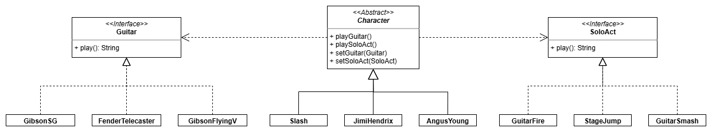

# Guitar Hero

A representation of Guitar Hero objects that uses the **strategy pattern** to
enable algorithms to change dynamically.

Basically, each `Character` has a different `Guitar` and `SoloAct`. Each
`Guitar` and `SoloAct` have different `play()` functions. If we were to tie the
`Guitar` and `SoloAct` functionality to the `Character` that has that `Guitar`
and `SoloAct` then `Character`s would never be able to switch `Guitar` or
`SoloAct`. By creating separate types for `Guitar`s and `SoloAct`s we allow the
`Character`s to switch to a different `Guitar` or `SoloAct`. This wouldn't be
possible if `playGuitar()` and `playSoloAct()` were simply hard-coded in their
respective `Character`.

