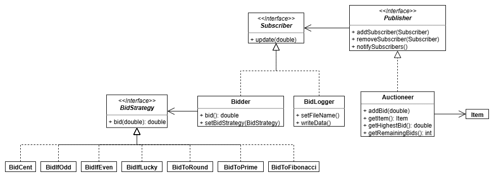

# Auction

An auction with multiple bidders.
The observer pattern is used to notify each bidder when the highest bid changes.
The strategy pattern is also used to represent different bid strategies.

