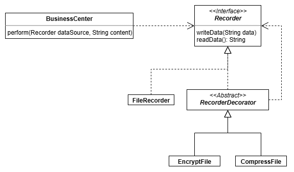

# File Recorder - Decorator Pattern

Uses the decorator pattern to modify data before it's written and after it's
been read. For example, being able to take `data -> write` and turn it into
`data -> encrypt -> write`, and take `read -> data` and turn it into
`read -> decrypt -> data`.

Also, the assignment was set up this way, so I didn't change it, but it
would've been better to call CompressFile and EncryptFile, CompressRecorder
and EncryptRecorder, because they don't necessarily write to a file.

