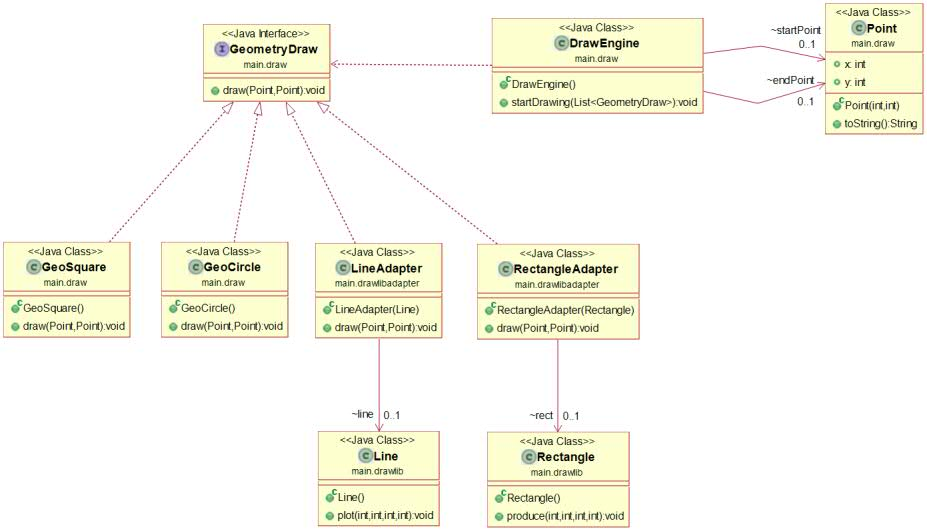

# Geometry Drawing - Adapter Pattern

I create an adapter for a library that works differently then my current code.
Basically, I give it a new interface so I can use it within my existing DrawEngine.

